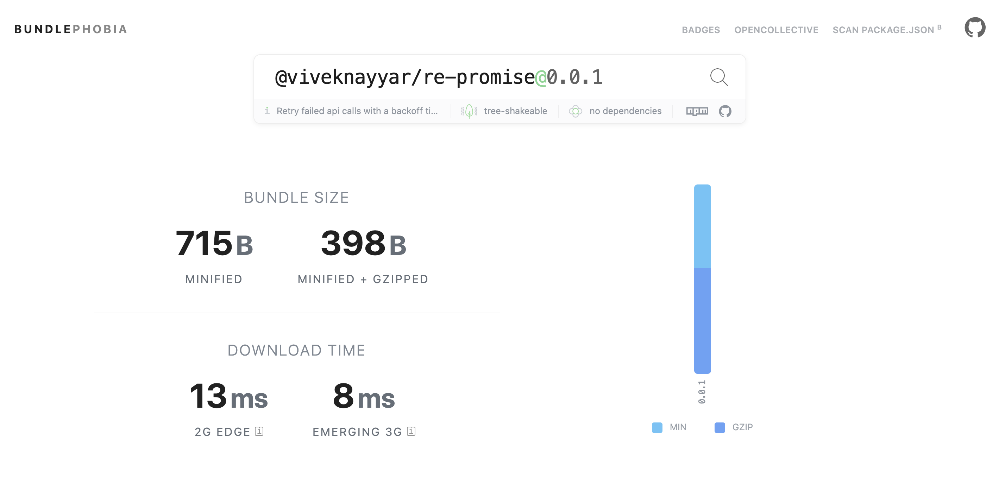

# 🧣 re-promise
[](#contributors)


[](https://travis-ci.com/vivek12345/re-promise)

Easy to use function for retrying failed promises/api calls with an exponential back off time.

### 🚚 Installation

```
yarn add re-promise
```

or

```
npm i re-promise --save
```

### ⚡️ Usage

```javascript

// some js function in your code which fetches users data

const fetchUser = id => {
  return new Promise((resolve, reject) => {
    setTimeout(() => {
      resolve({ id: 'vivek', name: 'vivek' });
    }, 10);
  });
};

```

```javascript
// with es6 await
import { retryPromise } from 're-promise';

async function retryAndFetchUser(id) {
  try {
    // await on this promise to resolve if you are using es6 await
    const resp = await retryPromise({
      fn: () => fetchUser(id),
      retries: 3,
      retryDelay: 2000,
      retryOn: function(e) {
        return [500, 502].includes(e.response.status);
      }
    });
  } catch (e) {
    console.log(e);
    return Promise.reject(e);
  }
}

```

```javascript
// with traditional promises
import { retryPromise } from 're-promise';

function retryAndFetchUsers(id) {
  return retryPromise({
    fn: () => fetchUser(id),
    retries: 3,
    retryDelay: 2000,
    retryOn: function(e) {
      return [500, 502].includes(e.response.status);
    }
  }).then(resp => {
    return resp;
  }).catch(e => {
    console.log(e);
    return Promise.reject(e);
  });
}

```

## 📒 Api

### 🧣 re-promise

| Props                   | Type                   | Default   | Description                                                                                         |
|-------------------------|------------------------|-----------|-----------------------------------------------------------------------------------------------------|
| fn                     | function                 | null      | function to call which should return a promise                                                                                      |
| retries              | number                 | 3         | The maximum amount of times to retry the operation.                                              |
| retryDelay               | number               | 3000         | The number of milliseconds before starting the retry.                |
| retryOn               | function               | null  | function to specify a custom logic to decide if retry should be done or not                                                  |
| backOffFactor               | function               | 1  | The exponential factor to use. Default is 1                                                  |
| debug               | boolean               | false  | print information around retry attempts                                                  |

#### fn (required)

This function will be called every time we want to retry a promis or an api call. Make sure you return a promise from this function.
It has the following signature:

```javascript
function fn() {
  return axios.get('some url);
}
```

#### retryOn (not compulsory field)

This function will be called every time we have to decide if the promise should be retried or not. This function will be called with the error object so you can put in logic inside this function to return true or false based on which we will decide if the api call should be retried or not.

```javascript
function retryOn(error) {
  // logic to retry on certain status codes
  return [502,500].includes(error.response.status);
}
```

## 📦 Size



## 👍 Contribute

Show your ❤️ and support by giving a ⭐. Any suggestions and pull request are welcome !

### 📝 License

MIT © [viveknayyar](https://github.com/vivek12345)

## 👷 TODO

- [x] Complete README
- [ ] Add Examples and Demo
- [x] Test Suite

## Contributors

Thanks goes to these wonderful people ([emoji key](https://github.com/kentcdodds/all-contributors#emoji-key)):

<!-- ALL-CONTRIBUTORS-LIST:START - Do not remove or modify this section -->
<!-- prettier-ignore -->
| [<br /><sub><b>Vivek Nayyar</b></sub>](https://www.viveknayyar.in/)<br />[📖](https://github.com/vivek12345/re-promise/commits?author=vivek12345 "Documentation") [💻](https://github.com/vivek12345/re-promise/commits?author=vivek12345 "Code") [🎨](#design-vivek12345 "Design") [💡](#example-vivek12345 "Examples") |
| :---: |
<!-- ALL-CONTRIBUTORS-LIST:END -->

This project follows the [all-contributors](https://github.com/kentcdodds/all-contributors) specification. Contributions of any kind welcome!